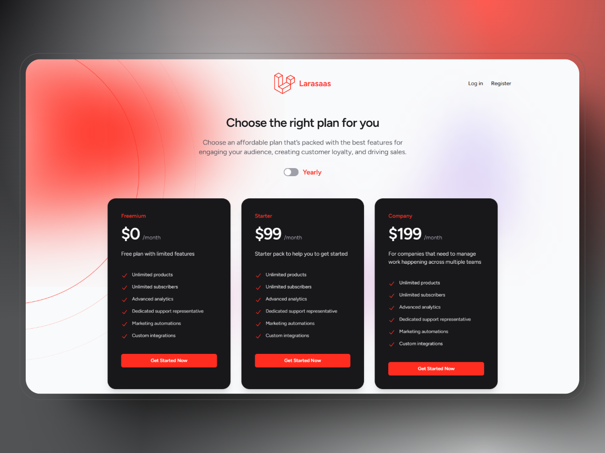

# Larasaas



**Larasaas** is a SaaS (Software as a Service) starter kit built with Laravel. It provides a robust foundation for building SaaS applications quickly and efficiently. This boilerplate includes essential features like user authentication, subscription billing, plans management, and Stripe integration, allowing you to focus on developing your unique business logic.

[](LICENSE)
## Features

- **User Authentication**: Ready-to-use authentication system for user registration, login, and password management.
- **Subscription Billing**: Integrated Stripe subscription management for handling recurring payments.
- **Plans Management**: Create, update, and manage subscription plans.
- **Features Management**: Define and associate features with subscription plans.
- **Stripe Plans Synchronization**: Automatically synchronize plans and pricing with Stripe.

## Getting Started

Follow these steps to set up Larasaas on your local machine.

### Prerequisites

- PHP 8.1 or higher
- Composer
- Node.js and npm
- MySQL or another supported database
- Stripe account (for subscription billing)

### Installation

1. **Clone the Repository**

   ```bash
   git clone https://github.com/SKSritharan/larasaas.git
   cd larasaas
   ```

2. **Install Dependencies**

   Install PHP dependencies using Composer:

   ```bash
   composer install
   ```

   Install JavaScript dependencies using npm:

   ```bash
   npm install
   ```

3. **Set Up Environment Variables**

   Copy the `.env.example` file to `.env`:

   ```bash
   cp .env.example .env
   ```

   Update the `.env` file with your database credentials and Stripe API keys:

   ```dotenv
   DB_DATABASE=your_database_name
   DB_USERNAME=your_database_user
   DB_PASSWORD=your_database_password

   STRIPE_KEY=your-stripe-publishable-key
   STRIPE_SECRET=your-stripe-secret-key
   ```

4. **Generate Application Key**

   Generate a unique application key:

   ```bash
   php artisan key:generate
   ```

5. **Run Migrations**

   Set up the database schema & get default user, roles, and permissions by running following command:

   ```bash
   php artisan migrate --seed
   ```

    > The default admin credentials for accessing the admin panel are:
    > Email: ```admin@admin.com```
    > Password: ```password```
    > Make sure to change these credentials after your initial login for security purposes.

6. **Start the Development Server**

   Launch the application using Laravel's built-in server:

   ```bash
   php artisan serve
   ```

   Visit `http://localhost:8000` in your browser to view the application.

## Stripe Plans Synchronization

To synchronize your subscription plans with Stripe, follow these steps:

1. **Set Stripe API Keys**

   Ensure your Stripe API keys are correctly set in the `.env` file:

   ```dotenv
   STRIPE_KEY=your-stripe-publishable-key
   STRIPE_SECRET=your-stripe-secret-key
   ```

2. **Run the Sync Command**

   Synchronize your plans with Stripe using the following Artisan command:

   ```bash
   php artisan plans:sync
   ```

   This command will fetch your Stripe products and prices and store them in the local database.

Certainly! Here's a refined and more detailed version of the Stripe Webhooks setup instructions:

## Stripe Webhooks Setup

To handle real-time events from Stripe, you need to set up Stripe webhooks. Follow these steps to configure and test webhooks in Larasaas:

### 1. **Create a Stripe Webhook**

Run the following command to create a Stripe webhook:

```bash
php artisan stripe:webhook
```

This command will create a webhook endpoint in your Stripe Dashboard and print the **Webhook Signing Secret**. Copy this secret.

### 2. **Update `.env` with Webhook Secret**

Add the **Webhook Signing Secret** to your `.env` file:

```dotenv
STRIPE_WEBHOOK_SECRET=your-webhook-signing-secret
```

### 3. **Listen to Stripe Events**

Use the Stripe CLI to listen to events and forward them to your local development environment. Run the following command:

```bash
stripe listen --forward-to http://larasaas.test/stripe/webhook
```
Replace `http://larasaas.test/stripe/webhook` with your actual webhook URL.

### 4. **Trigger Test Events**

To test your webhook, trigger a test event using the Stripe CLI. For example, to simulate a successful payment, run:

```bash
stripe trigger payment_intent.succeeded
```

- This will send a test event to your webhook URL.
- You can view the event details in your Stripe Dashboard under **Developers > Webhooks > Events**.

### 5. **Verify Webhook Handling**

- Check your Laravel logs (`storage/logs/laravel.log`) to ensure the webhook events are being handled correctly.

## Documentation

For detailed documentation, including setup instructions, feature explanations, and customization guides, visit the [Larasaas Documentation](https://medium.com/@sritharansk/larasaas-saas-boilerplate).

## Contributing

Contributions are welcome! If you'd like to contribute to Larasaas, please follow these steps:

1. Fork the repository.
2. Create a new branch for your feature or bugfix.
3. Commit your changes and push to the branch.
4. Submit a pull request.

## License

Larasaas is open-source software licensed under the [MIT License](LICENSE).

## Support

If you encounter any issues or have questions, feel free to [open an issue](https://github.com/SKSritharan/larasaas/issues) on GitHub.

## Acknowledgments

- Built with [Laravel](https://laravel.com), the PHP framework for web artisans.
- Integrated with [Stripe](https://stripe.com) for subscription billing.

Happy coding! 🚀
